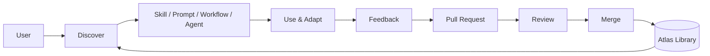

# Claude Skills Atlas

<p align="center">
  <strong>A community-driven open-source library of reusable Claude skills, prompts, workflows, agents, and templates.</strong>
</p>

<p align="center">
  <a href="https://github.com/cellrishi-code/claude-skills-atlas/stargazers">Star</a> ·
  <a href="https://github.com/cellrishi-code/claude-skills-atlas/issues">Issues</a> ·
  <a href="https://github.com/cellrishi-code/claude-skills-atlas/pulls">Pull Requests</a> ·
  <a href="CONTRIBUTING.md">Contribute</a>
</p>

<p align="center"><em>Find it. Copy it. Adapt it. Share it.</em></p>

---

## What is Claude Skills Atlas?

Claude Skills Atlas is a growing collection of **practical, copy-paste-ready building blocks for Claude**.

Instead of keeping useful prompts and instructions scattered across chats, bookmarks, tutorials, and personal notes, this project organizes them into a community-maintained library.

You can use the repository to:

- Discover reusable **Claude Skills**
- Copy **prompt templates**
- Follow repeatable **workflows**
- Build specialized **agents**
- Start from reusable **templates**
- Contribute improvements for others to use

> **The goal:** build a high-quality public knowledge base for getting better results from Claude across technical, scientific, creative, and professional work.

---

## What's inside? 🧩

| Type | Purpose | Example |
|---|---|---|
| **Skills** | Reusable instruction packages | Code review, research analysis |
| **Prompts** | Ready-to-copy prompts | Debugging, proof solving |
| **Workflows** | Multi-step procedures | Plan → implement → verify |
| **Agents** | Specialized agent instructions | Research assistant |
| **Templates** | Reusable structures | Skill and prompt templates |

---

## Explore by domain 🌍

**Computer Science** · **Programming** · **AI / ML** · **Mathematics** · **Statistics** · **Physics** · **Chemistry** · **Biology** · **Medicine** · **Engineering** · **Robotics** · **Data Science** · **Research** · **Cybersecurity** · **DevOps / Cloud** · **Writing** · **Education** · **Business** · **Finance** · **Design** · **Productivity**

**Don't see your field? Create the category.**

---

## Quick start 🚀

### 1. Browse

~~~text
skills/       → reusable SKILL.md files
prompts/      → copy-paste prompts
workflows/    → repeatable processes
agents/       → specialized agent definitions
templates/    → reusable structures
~~~

### 2. Pick something useful

- [Code Review Skill](skills/coding/code-review/SKILL.md)
- [Implementation Planner](skills/coding/implementation-planner/SKILL.md)
- [Evidence Checker](skills/research/evidence-checker/SKILL.md)
- [Mathematics Problem Solver](skills/mathematics/problem-solver/SKILL.md)
- [Debugging Prompt](prompts/coding/debugging.md)
- [Paper Reading Prompt](prompts/research/paper-reading.md)
- [Active Learning Prompt](prompts/learning/active-learning.md)

### 3. Copy → adapt → use

Most resources are designed to be understandable on their own.

Open the file, copy the instructions, adapt them to your project, and use them in your Claude workflow.

---

## How the Atlas works

The Atlas is a community library: people discover reusable resources, adapt them to real tasks, contribute improvements, and feed those improvements back into the library.

**Visual architecture:** [docs/diagrams.md](docs/diagrams.md)



This makes the project more than a static prompt collection: **resources improve through real community use and contribution.**

## What makes a good Skill? 🛠️

A useful skill should give Claude **clear, reusable behavior**, not just a vague instruction.

Good skills generally include:

1. **A clear purpose**
2. **When to use the skill**
3. **A repeatable process**
4. **Important constraints**
5. **Expected output**
6. **Verification or quality checks**

Example:

~~~text
skills/
└── coding/
    └── my-skill/
        └── SKILL.md
~~~

See the [Skill Template](templates/skill-template.md).

---

## Copy-paste prompt library 📚

Prompts are intentionally kept easy to reuse.

~~~text
prompts/
├── coding/
│   ├── debugging.md
│   └── refactor.md
├── mathematics/
│   └── proof-explainer.md
├── research/
│   ├── claim-audit.md
│   └── paper-reading.md
└── learning/
    └── active-learning.md
~~~

Want to add your own? See the [Prompt Template](templates/prompt-template.md).

---

## Built for serious work 🔬

The Atlas is not limited to coding.

You can contribute resources for:

- Scientific research
- Literature reviews
- Mathematical reasoning
- Biology and life sciences
- Physics and chemistry
- Software engineering
- AI / machine learning
- Data analysis
- Cybersecurity
- Technical writing
- Teaching and learning
- Engineering
- Design
- Business and productivity

If a task is **repeatable**, it can potentially become a reusable Claude resource.

---

## Install the Atlas in your agent

The Atlas can be consumed as a **public skill and prompt library**, not only as a repository to browse.

### Claude Code

```text
/plugin marketplace add cellrishi-code/claude-skills-atlas
/plugin install claude-skills-atlas@claude-skills-atlas
```

### Any compatible agent

Clone the repository and copy the resources you need:

```bash
git clone https://github.com/cellrishi-code/claude-skills-atlas.git
```

- `skills/` → reusable `SKILL.md` instructions
- `prompts/` → ready-to-use prompts
- `workflows/` → repeatable procedures
- `agents/` → specialized agent instructions
- `templates/` → reusable structures

See **[INSTALL.md](INSTALL.md)** for the complete setup guide.

## Plugins

The Atlas also ships installable Claude Code plugins.

### Atlas Library Plugin

The **Atlas Library** plugin gives an agent a reusable entry point to the public skills, prompts, workflows, agents, and templates in this repository.

- [Atlas plugin](plugins/atlas/README.md)
- [Atlas skill](plugins/atlas/skills/atlas/SKILL.md)

### GitHub Agent

The **GitHub Agent** plugin gives Claude Code a portable GitHub workflow through the `gh` CLI.

- [GitHub Agent plugin](plugins/github-agent/README.md)
- [Plugin manifest](plugins/github-agent/.claude-plugin/plugin.json)
- [GitHub skill](plugins/github-agent/skills/github/SKILL.md)
- [GitHub operator agent](plugins/github-agent/agents/github-operator.md)

## Contribute to the Atlas 🤝

Everyone is welcome — beginners, students, researchers, engineers, designers, and experienced open-source contributors.

### Contribution flow

~~~text
Fork
  ↓
Create a branch
  ↓
Add your skill / prompt / workflow / agent
  ↓
Test it
  ↓
Open a Pull Request
  ↓
Community review
  ↓
Merge
~~~

### Before opening a PR

- Make the resource genuinely useful
- Keep instructions clear and reusable
- Use lowercase kebab-case names
- Avoid private information and secrets
- Test the resource when practical
- Credit external inspiration or sources
- Only submit material you have permission to redistribute
- Explain what your contribution does

Read the full [CONTRIBUTING.md](CONTRIBUTING.md).

---

## Quality & safety 🛡️

We want the Atlas to be useful **and trustworthy**.

| Principle | Meaning |
|---|---|
| **Useful** | Solves a real, repeatable problem |
| **Clear** | Easy for another person to understand |
| **Reusable** | Avoids private context and hard-coded identity |
| **Honest** | States limitations and uncertainty |
| **Attributed** | Respects licenses and original creators |
| **Safe** | No credentials, malware, or malicious payloads |

When adapting ideas from public discussions or repositories, prefer creating an **original implementation** and linking the source rather than copying large third-party collections.

See [docs/community-sources.md](docs/community-sources.md) for the project's curation policy.

---

## Documentation 📖

| Document | Purpose |
|---|---|
| [CONTRIBUTING.md](CONTRIBUTING.md) | How to contribute |
| [CODE_OF_CONDUCT.md](CODE_OF_CONDUCT.md) | Community standards |
| [SECURITY.md](SECURITY.md) | Security policy |
| [SUPPORT.md](SUPPORT.md) | Getting help |
| [docs/architecture.md](docs/architecture.md) | Repository architecture |
| [docs/community-sources.md](docs/community-sources.md) | Curated external sources |
| [Skill Template](templates/skill-template.md) | Create a new skill |
| [Prompt Template](templates/prompt-template.md) | Create a new prompt |

---

## Help the project grow ⭐

If you find this useful:

**Star the repository** · **Fork it** · **Add a resource** · **Open a Pull Request** · **Share it**

Every useful contribution makes the Atlas better for the next person.

---

## Repository structure

~~~text
claude-skills-atlas/
│
├── skills/             # Reusable Claude skills
├── prompts/            # Copy-paste prompt templates
├── workflows/          # Multi-step workflows
├── agents/             # Specialized agents
├── templates/          # Reusable templates
├── docs/               # Documentation & curation
│
└── .github/            # Issues, PR templates, CODEOWNERS
~~~

---

## License

Released under the **MIT License**.

See [LICENSE](LICENSE) for details.

---

<p align="center">
  <strong>Claude Skills Atlas</strong><br>
  <sub>A community library for better Claude workflows.</sub>
</p>

<p align="center"><em>Built by the community. Improved by everyone.</em></p>
