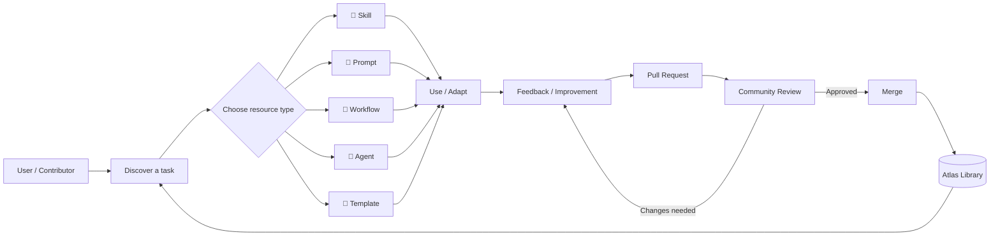
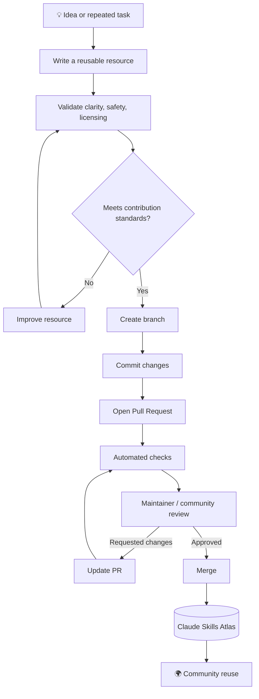
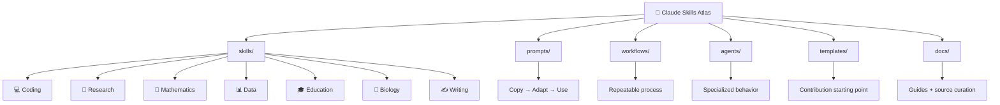
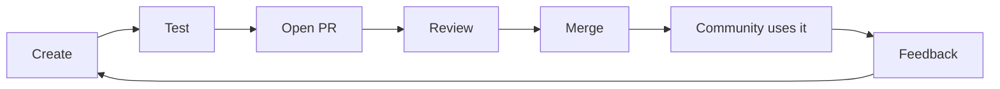

# Claude Skills Atlas — How It Works

The Atlas is a community-maintained library of reusable Claude building blocks. GitHub renders Mermaid diagrams directly in Markdown, so these diagrams stay editable and version-controlled.

## 🧠 How the Atlas works

## 🤝 How a contribution becomes part of the Atlas

## 🧱 Resource architecture

## 🔁 The contribution loop

## Design principle

A good Atlas resource should be **specific, reusable, testable, and honest about its limitations**.

The visual diagrams complement the written contribution rules; the repository remains understandable without the diagrams.
